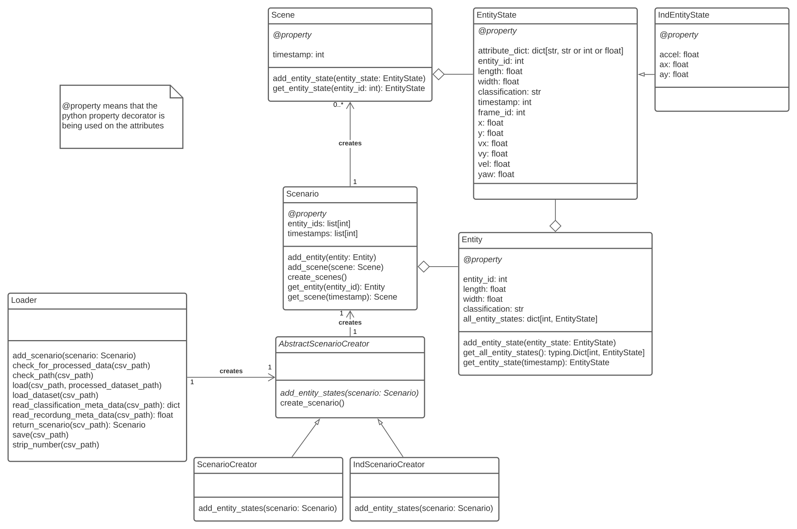

# csv object list dataset loader

Reads in .csv files in either [TAF](https://github.com/fzi-forschungszentrum-informatik/test-area-autonomous-driving-dataset), [INTERACTION](https://interaction-dataset.com/) or [inD](https://www.ind-dataset.com/) format and creates an object structure based on the following class diagram:



## Documentation

Requirements:
[pdoc](https://pdoc.dev/)
```bash
pip install pdoc
```

A doc-file can be generated by
```bash
pdoc src/csv_object_list_dataset_loader -o docs
```
The documentation can then be found [here](/docs/index.html) (to be opened with a browser).

__Issues:__  
Keep in mind that this module needs at least python3.9! This means pdoc should be installed within a interpreter environment that allows python3.9+.

## Installation
The loader module can be installed by pip.
It is recommended to create a virtual environment
```bash
# venv
sudo apt install -y python3.9
sudo apt install -y python3.9-dev python3.9-venv
python3.9 -m venv MY_VENV
source MY_VENV/bin/activate
```
```bash
git clone $LINK_TO_REPO
cd csv_object_list_dataset_loader/
pip install -r requirements.txt

pip install . # install this module to pip
```
# Usage

1. initialize an object of the Loader class with the wanted parameters
2. run `your_loader_object.load_dataset(csv_path)`
3. get your Scenario with `your_loader_object.return_scenario(csv_path)`


### Example


```python
import csv_object_list_dataset_loader as cl

loader = cl.Loader()
path_to_file = "tests/data/taf/vehicle_tracks_000.csv"
loader.load_dataset(path_to_file, clean_load=False, verbose=False)
scenario = loader.return_scenario(path_to_file)

print(scenario.entity_ids)
entity_5 = scenario.get_entity(entity_id=5)
print(entity_5.all_entity_states.keys())
entity_state_5_100 = entity_5.get_entity_state(timestamp=100)

print(scenario.timestamps)
scene_100 = scenario.get_scene(timestamp=100)
entity_state_5_100_clone = scene_100.get_entity_state(entity_id=5)
print("pos x/y", entity_state_5_100.x, entity_state_5_100.y)

assert (entity_state_5_100 == entity_state_5_100_clone)
```

### Licenses

| Library       | License            |
|---------------|--------------------|
| pandas        | BSD 3              |
| numpy         | BSD                |
